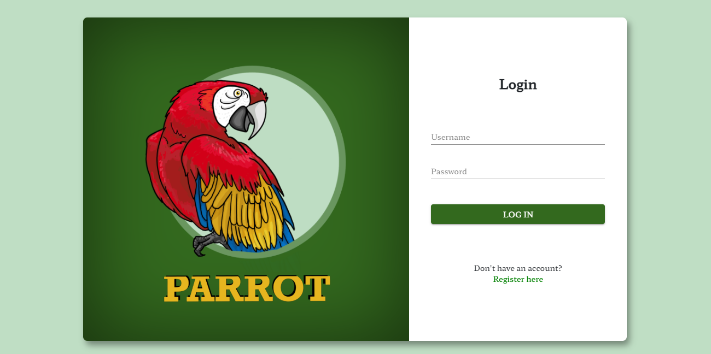

# ParrotUI

Front-end part for the **Parrot** web app - an application supporting the learning of foreign languages, created for *Project Team* classes at the Jagiellonian University.



## Table of contents
* [General info](#about)
* [Technologies](#technologies)
* [Setup](#setup)

## About

### Motivation

**Parrot** is addressed to people who struggle with learning foreign languages and need a tool that will enable them to save newly learned vocabulary or phrases, as well as regularly repeat them to increase and check the state of their knowledge. As the number of new words increases over time,
learners also need the ability to put the expressions into categoires, which is especially important when they are studying for a test/exam or simply want to introduce variety into the learning process and each day
train a different set.

### Functionalities

As a user, after sign up to the application, you can:

:heavy_check_mark: create your own sets of terms for each pair of languages\
:heavy_check_mark: switch languages\
:heavy_check_mark: create labels for each set, and add them to words independently\
:heavy_check_mark: take part in quiz\
:heavy_check_mark: select quiz strategy

.. and many more!

## Technologies
* Angular 14
* Angular Material 14
* Bootstrap 5

## Setup

### Prerequisites

1. Download and install node.js (LTS version) from ` https://nodejs.org ` .
2. Install Angular using npm: ``` npm install -g @angular/cli ```.
3. Ask [@Bartanakin]( https://github.com/Bartanakin ) for access to parrot-api repository and configure back-end application.

### Installation and usage

Follow the steps below to run the app locally.
1. Clone the parrot-ui repository.
3. Run ``` npm install ``` in the parrot-ui root directory to install necessary packages.
4. Run ``` npm start ``` and wait for compilation to finish.
5. Navigate to `http://localhost:4200/`.


